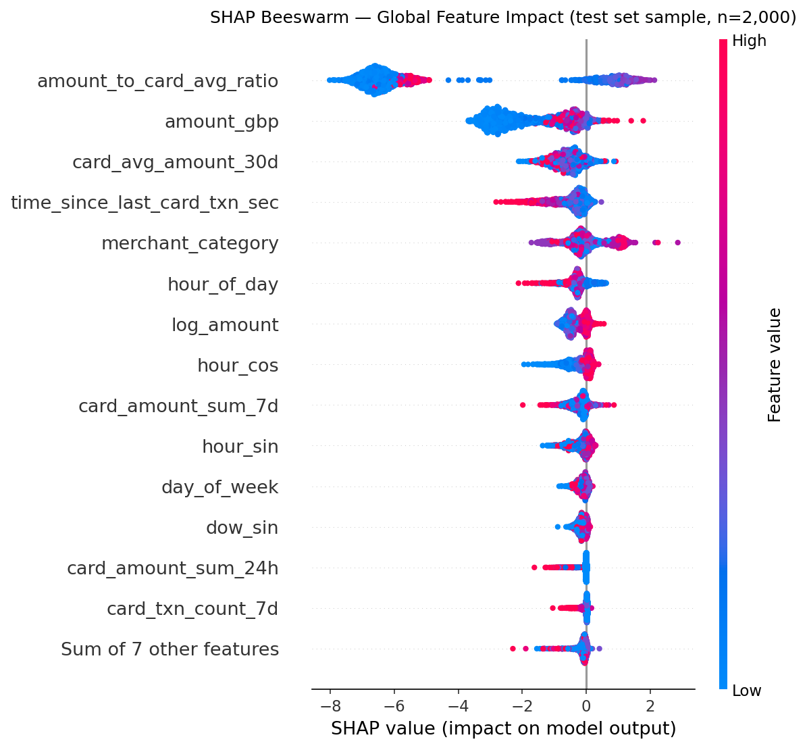
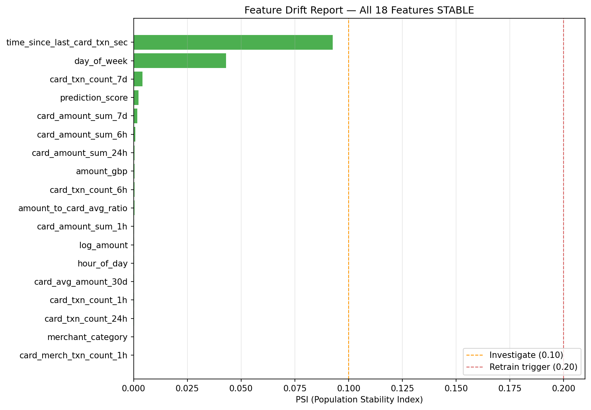

# Fraud Scoring Service

[](https://github.com/nufelroknidev/fraud-detection-service/actions/workflows/ci.yml)


**Real-time card-not-present (CNP) fraud scoring service for a UK BNPL / e-commerce payment processor.**

End-to-end ML system: synthetic data generation → feature engineering → XGBoost → FastAPI serving with per-prediction SHAP explanations → Evidently PSI drift monitoring → GitHub Actions CI/CD.

---

## Results

| Metric | Value |
|--------|-------|
| ROC-AUC | 0.9483 |
| PR-AUC | 0.2291 |
| Gini coefficient | 0.8966 (target > 0.60) |
| KS statistic | 0.7668 |
| F1-optimal threshold | 0.8820 → 36% precision / 24% recall |
| High-recall threshold | 0.1013 → 2.4% precision / 80% recall |
| Cost-optimal threshold | 0.3153 → £80k saving vs no-model baseline |
| Expected £ saving vs F1-threshold | £28k per 100k transactions |
| p50 latency (50 concurrent users) | 110 ms |
| p95 latency (50 concurrent users) | 200 ms |
| p99 latency (50 concurrent users) | 270 ms |
| Throughput | 166 RPS, 0% errors |

Experiment tracking: [DagsHub — nufel.rokni.dev/fraud-detection-service](https://dagshub.com/nufel.rokni.dev/fraud-detection-service)

---

## Architecture

```
[Synthetic Transaction Generator]
           │
           ▼
[Feature Engineering (velocity + static)]
           │
           ▼
[XGBoost Classifier] ──► [MLflow / DagsHub]
           │
           ▼
[FastAPI Scoring Service]
  /predict  /health  /metrics
           │
           ▼
[Evidently Drift Monitor (PSI per feature)]
```

---

## Tech Stack

| Layer | Technology |
|-------|------------|
| Model | XGBoost (gradient boosted trees, sklearn Pipeline) |
| Serving | FastAPI + uvicorn, Dockerized |
| Experiment tracking | MLflow on DagsHub |
| Explainability | SHAP (TreeExplainer — global beeswarm + per-prediction top-3) |
| Drift monitoring | Evidently (PSI per feature + score distribution) |
| Load testing | Locust (50 users, 166 RPS, p99 270 ms) |
| CI/CD | GitHub Actions (lint → unit tests → Docker smoke test) |

---

## Project Structure

```
fraud-detection-service/
├── src/
│   ├── data/generate.py          # Synthetic CNP transaction generator (600k txns)
│   ├── features/velocity.py      # Feature engineering: velocity, amount deviation, cyclic time
│   ├── model/train.py            # XGBoost training + MLflow logging
│   ├── model/cost_matrix.py      # Cost-optimal threshold sweep
│   ├── monitoring/drift.py       # Evidently PSI drift monitor
│   └── api/main.py               # FastAPI scoring service
├── tests/
│   ├── test_api.py               # API integration tests (16 tests)
│   └── locustfile.py             # Locust load test
├── notebooks/
│   └── shap_explainability.ipynb # SHAP analysis notebook
├── docs/
│   ├── model_card.md             # Intended use, performance, limitations, fairness
│   └── champion_challenger.md    # 95/5 traffic-split rollout and shadow mode design
├── .github/workflows/ci.yml      # 3-job CI pipeline
├── Dockerfile
└── docker-compose.yml
```

---

## Explainability

Each `/predict` response includes the top 3 SHAP feature contributions for the transaction, enabling compliance officers to audit every automated decision.

The beeswarm below shows global feature impact across a 2,000-transaction test-set sample. Each dot is one transaction; x-position is the SHAP value (log-odds contribution to fraud probability); colour is the raw feature value (red = high, blue = low).



`amount_to_card_avg_ratio` is the dominant signal: transactions where the amount greatly exceeds the card's 30-day average are pushed strongly toward fraud. `card_avg_amount_30d` and velocity features (`card_txn_count_1h`, `card_amount_sum_24h`) provide secondary lift.

---

## Monitoring

PSI (Population Stability Index) is tracked per feature using Evidently. Run with:

```bash
python -m src.monitoring.drift
```



All features are **stable** on synthetic data (PSI < 0.10). `time_since_last_card_txn_sec` is the highest at 0.0925. `prediction_score` PSI is 0.0023, confirming output distribution stability.

> **Scope note:** PSI values are computed between two windows of the same synthetic dataset (reference = first 60%, current = last 20%). Both windows share the same generative process, so near-zero results validate the monitoring pipeline, not production stability. In a live deployment the reference window would be the training distribution and the current window a rolling 7-day buffer of scored transactions.

| PSI Range | Status | Action |
|-----------|--------|--------|
| < 0.1 | Stable | None |
| 0.1 – 0.2 | Investigate | Review feature source |
| > 0.2 | Retrain trigger | Initiate retraining pipeline |

---

## Champion / Challenger Deployment

See [`docs/champion_challenger.md`](docs/champion_challenger.md) for the full rollout design.

- Traffic split via `hash(card_id) % 100`: 95% champion, 5% challenger
- Shadow mode promotion gates: ≥ 10,000 observations, PR-AUC ≥ 85% of champion, KL-divergence < 0.10, p99 within 20%
- Rollback: single MLflow model alias change — no redeployment required

---

## Run Locally

### Option A — Docker (recommended)

```bash
docker compose up --build
# API available at http://localhost:8000
```

### Option B — From source

```bash
# 1. Install dependencies
pip install -r requirements.txt

# 2. Generate synthetic data + train model
python -m src.model.train

# 3. Start the API
uvicorn src.api.main:app --reload
```

### Sample request

```bash
curl -X POST http://localhost:8000/predict \
  -H "Content-Type: application/json" \
  -d '{
    "amount_gbp": 450.0,
    "hour_of_day": 14,
    "day_of_week": 2,
    "card_avg_amount_30d": 60.0,
    "card_txn_count_1h": 3,
    "card_amount_sum_1h": 1350.0,
    "card_txn_count_6h": 5,
    "card_amount_sum_6h": 2250.0,
    "card_txn_count_24h": 6,
    "card_amount_sum_24h": 2700.0,
    "card_txn_count_7d": 8,
    "card_amount_sum_7d": 3600.0,
    "card_merch_txn_count_1h": 2,
    "time_since_last_card_txn_sec": 120.0,
    "amount_to_card_avg_ratio": 7.5,
    "log_amount": 6.109,
    "hour_sin": -0.5,
    "hour_cos": -0.866,
    "dow_sin": 0.7818,
    "dow_cos": 0.6235,
    "merchant_category": "electronics"
  }'
```

Example response for a high-risk transaction (£450 on a £60-average card, 3 transactions in the last hour):

```json
{
  "fraud_probability": 0.873,
  "f1_opt_decision": "BLOCK",
  "recall80_decision": "REVIEW",
  "f1_opt_threshold": 0.882,
  "recall80_threshold": 0.101,
  "top_features": [
    {"feature": "amount_to_card_avg_ratio", "shap_value": 1.842, "direction": "increases_risk"},
    {"feature": "card_txn_count_1h",        "shap_value": 0.631, "direction": "increases_risk"},
    {"feature": "card_avg_amount_30d",      "shap_value": -0.294, "direction": "decreases_risk"}
  ],
  "oot_features": []
}
```

---

## Docs

- [Model Card](docs/model_card.md) — intended use, performance table, limitations, fairness considerations
- [Champion / Challenger Design](docs/champion_challenger.md) — traffic split, shadow mode promotion gates, rollback procedure

---

## Domain Context

Card-not-present fraud is the highest-volume fraud type in UK e-commerce (~0.03–0.1% of transactions). This service scores each transaction at submission time, returning a fraud probability and SHAP-based explanation for compliance use.

### Fraud Signals Used

- Velocity: transactions per card in last 1h, 6h, 24h, and 7d
- Amount deviation from card's 30-day rolling average
- Merchant category risk score (CNP-weighted)
- Hour-of-day and day-of-week encoding (cyclic sin/cos)
